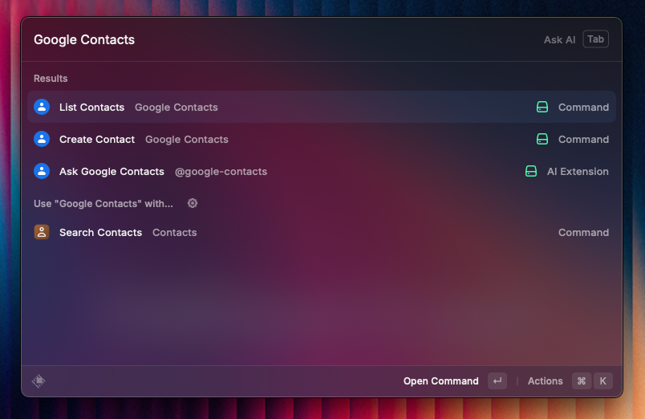
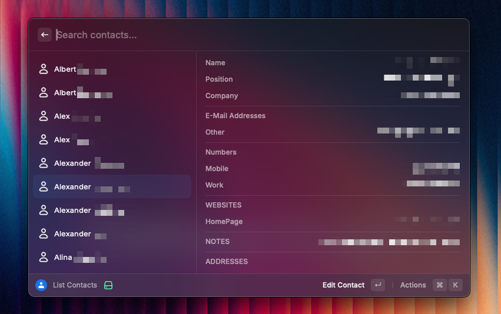
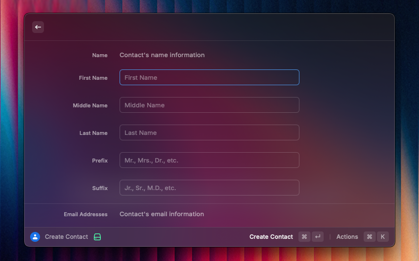
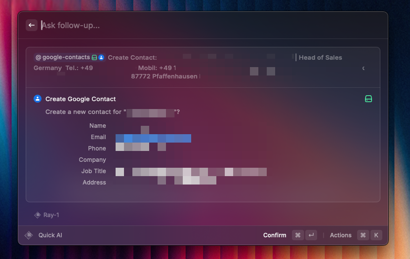

  
  <h1>
    Google Contacts
  </h1>
Manage your Google Contacts directly from Raycast with complete integration, including AI capabilities..

    
    
    
  

  

    
    
    
    
    
  

    

## Features

### Core Features
- 🔍 Search contacts by name, email, or phone number
- 👁️ View detailed contact information
- ⭐ Mark contacts as favorites for quick access
- ➕ Create new contacts with comprehensive details
- ✏️ Edit existing contacts (all fields supported)
- 🗑️ Delete contacts
- 🔄 Sync with Google Contacts API

### Contact Details Supported
- Full name (first, middle, last, prefix, suffix)
- Multiple email addresses with labels
- Multiple phone numbers with labels
- Company and job title information
- Birthday (DD.MM.YYYY format)
- Physical addresses
- Websites
- Custom fields
- Notes/biographical information

### AI Features
The extension provides AI tools that allow Raycast AI to interact with your Google Contacts:

- **Search contacts using natural language**: Ask Raycast AI to find contacts by name, email, company, etc.
- **Create contacts through conversation**: Tell Raycast AI to add new contacts with any details you specify

## Configuration

### OAuth Setup Requirements

1. **Create a Google Cloud Project**:
   - Go to [Google Cloud Console](https://console.cloud.google.com/)
   - Create a new project or select an existing one

2. **Enable the Google People API**:
   - Navigate to [API Library](https://console.cloud.google.com/apis/library/people.googleapis.com)
   - Search for "People API" and enable it for your project

3. **Create OAuth Credentials**:
   - Go to [Credentials page](https://console.developers.google.com/apis/credentials)
   - Click "Create Credentials" and select "OAuth client ID"
   - Select "iOS" as the Application type (required for PKCE authentication)
   - Enter "com.raycast" as the Bundle ID
   - Complete the form and create the credentials
   - In the OAuth consent screen, add the following scope: `https://www.googleapis.com/auth/contacts`

4. **Add Client ID to Raycast**:
   - Copy the Client ID (NOT the Client Secret)
   - Open Raycast and go to this extension's preferences
   - Paste the Client ID in the "OAuth Client ID" field

## Usage

### Regular Commands

#### List Contacts
- Open Raycast and search for "List Contacts"
- Browse, search, and manage your contacts
- Use keyboard shortcuts for common actions:
  - ⌘E - Edit contact
  - ⌘⌫ - Delete contact
  - ⌘F - Toggle favorite
  - ⌥⌘↩ - Open in Google Contacts
  - ⇧⌘E - Copy primary email
  - ⇧⌘P - Copy primary phone

#### Create Contact
- Open Raycast and search for "Create Contact"
- Fill in the information fields
- Use checkboxes to show/hide optional sections

### AI Commands

Use Raycast AI to interact with your Google Contacts using natural language:

#### Search Examples:
- "Find John Smith in my contacts"
- "Search for contacts at Acme Corporation"
- "Look up anyone with a gmail.com email address"
- "Find contacts in the Marketing department"

#### Create Examples:
- "Add Jane Smith to my contacts with email jane@example.com and phone +1-555-1234"
- "Create a contact for Bob Johnson who works as Marketing Director at XYZ Inc."
- "Add a new contact: Sarah Williams, sarah.williams@company.com, birthday 15.04.1985"

## Troubleshooting

### Authentication Issues
- Ensure your Google Cloud project has the People API enabled
- Verify that you've added the correct OAuth scope (`https://www.googleapis.com/auth/contacts`)
- Make sure you've copied the Client ID correctly, not the Client Secret
- Try signing out and back in if you're experiencing authentication errors

### Performance Tips
- The extension uses caching to improve performance
- Results are limited to help with large contact lists
- For searches, try to be specific in your query

## Requirements

- A Google account with contacts
- Raycast v1.57.0 or later
- OAuth Client ID from Google Cloud Console

## Privacy

This extension only accesses your Google Contacts data with your explicit permission. All data is handled according to Google's API usage policies and is not stored outside your device except when syncing with Google's servers.

Happy contact management! 🎉
